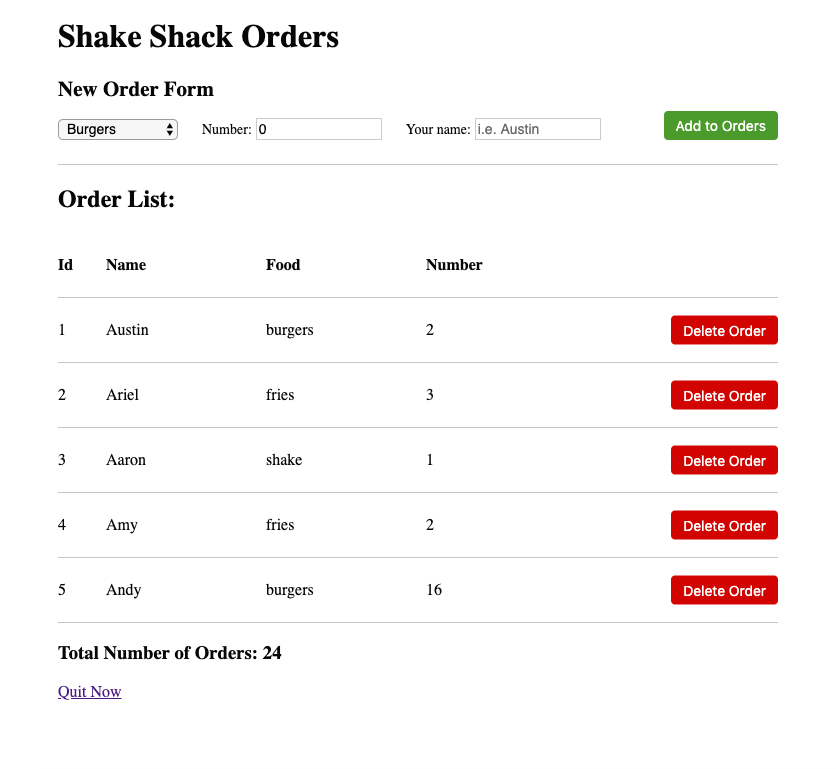

# Guide Introduction

Welcome! Today we will create our first React web application. It will be an Order List manager app for the American burger chain Shake Shack (not actually though).

The functionalities of this app are simple:
 - Allow an employee to view all current orders
 - Allow an employee to add an order
 - Allow an employee to delete an order
 - If an employee has too many orders, there is a link they can click on to quit their job!
 - If the employee regrets quitting, they may come back and resume working lol.

For reference, here is a screenshot of the final application:
Here's the screenshot of the order managing web-tool.


Here's the screenshot of the webpage to notify that you've successfully quit your job!


## Getting Started (installing a TextEditor)
I recommend using Atom (https://atom.io/) as your text editor for working with front-end development.
But there are many others you may use like SublimeText.

## Getting Started (installing Node and starting your web application)
You will first need to install [nodeJS and npm](https://www.npmjs.com/get-npm).
You can confirm things have successfully installed by running:
```
node -v
npm -v
```

Using Terminal (Mac) or Command Prompt (Windows), traverse to the root directory (same directory as `index.html`) and run:
```
npm install
```

If there are no errors, let's run our web application! In the root directory, run:
```
parcel index.html
```
You should see a "Server running at http://localhost:1234" or something similar.
Open a browser (like Chrome) and go to that url link. You should see what your starting application renders!


## Project Directory
I've given you starting code. Your current `index.html` should be linked to the contents in folder `components`. Inside `index.html`, you should see the following line:
```
<script src="./components/main.js"></script>
```
If at any time you would like to see how the application correctly behaves, replace `components` with `components_answer`.


To move on to the first task, click [here](./01_prerequisites.md).
