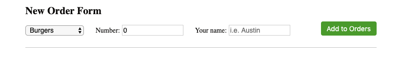

# Inputs and On-Change

In HTML, the most common Input fields are the text ones where a user can type text into them (like on a form).
There are other input fields as well such as checkboxes, radio buttons, dropdown menus, etc.

To create the common text Input, use this:
```
<input type="text" placeholder="Type here"/>
```

Just like the button onClick handlers, inputs have an onChange handler. These onChange handlers are invoked whenever a user enters or deletes anything inside the input field. To use this onHandler, use this:
```
<input type="text" placeholder="Type here" onchange="onChangeText"/>
```
Whenever a user changes the text in the input (insert/delete characters), the `onChangeText` Javascript function will be called.

Here's the React way of using inputs:
```
class MyComp extends React.Component {

    onChangeText = (event) => {
        console.log("User typed: " + event.target.value);
    }

    render() {
        return (
            <div>
            <input type="text"
                onChange={(event) => this.onChangeText(event)}
            />
            </div>
        );
    }
}
```

What's going on here is that we have a text input where every time it is changed, we call `this.onChangeText` which is a function in this component called `onChangeText`. We've seen this pattern before in the previous chapter.

This function takes in one parameter which is known as an "event". The event is basically Javascript data that is created whenever a "click"/"change" event occurs. In this case, we pass the variable into `this.onChangeText()` to extract what the user typed into the input field with `event.target.value`.
So if a user inputs "asdf" into the textbox, we should see the following in our console.log:
```
User typed: a
User typed: as
User typed: asd
User typed: asdf
```

## Other Inputs
Another input we will use is the dropdown. This one is actually with a `<select>` tag, but the concepts are basically the same.
```
<select onChange={(e) => this.onChangeSelect(e)}>
    <option value="burgers">Burgers</option>
    <option value="fries">Fries</option>
    <option value="shakes">Shake</option>
</select>
```
This is a dropdown menu with 3 options (Burgers, Fries, and Shakes). Every time the user changes their selection, the `this.OnChangeSelect` function will be called. You can also use the "event" object we used before (but this time named `e`) to figure out what the user ended up selecting.
In this case, `e.target.value` will either be "burgers", "fries", or "shakes" which are the `values` described in each of the `<option>` tags.


## ShakeShack Exercise - Create inputs and select with hooked up OnChange handlers
Inside `home/homeOrderForm.js`, you should see a `HomeOrderForm` Component defined.
- Create one dropdown menu. This dropdown menu has 3 options: "Burgers", "Fries" and "Shakes".
- Create two text input fields.
  - One input field is for a customer's name.
  - The other input field is for a number as in the number of burgers they would like to order.

The flow here is to have a user fill out the form (select food, select number of that food, then type in name) and press the button "Add to Orders".

When the dropdown menu and input fields work, hook each element with an onChange handler that will be invoked whenever the user changes their selection or types in something different. I recommend having 3 onChange functions total, one for every input field.
Each function can simply `console.log` the user's select value. Test to see if you display a message in Console whenever you change a selection.

At this point, we probably want some text to label the different input fields.
Place `<span>Label Name</span>` next to the different input fields to "label" them so your user knows which field is for what kind of information.

*Style*
Give this inputs and select the following styled propeties:
- font family Helvetica
- font size of 14px
- A good amount of width. Use whatever makes sense for each input. For example, the number is probably a short value, so the input field can be more narrow.
- Give your form elements a bit of "breathing room" so they don't look so scrunched up together.
 - Make sure to remember the difference between margins and paddings here!

Refer to this image for guidance:


[Continue](./07_input_onchange.md)
