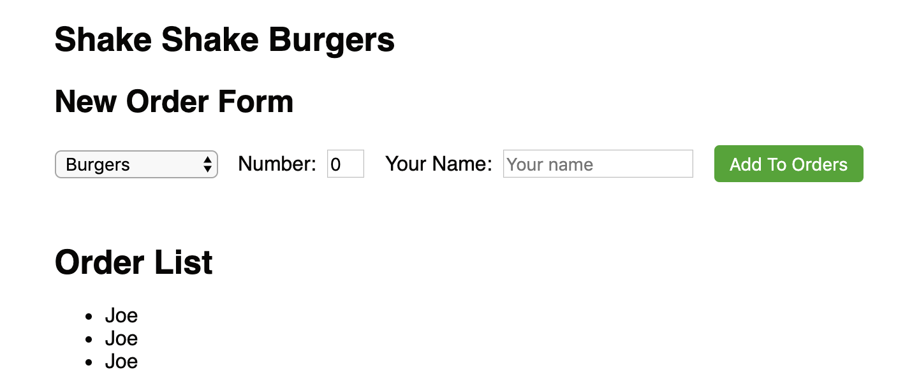
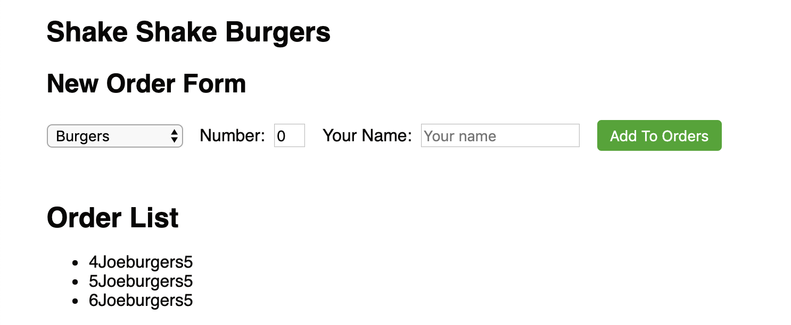

# React Lists

To create lists in HTML, we can use the unordered list `<ul>` tag. Inside this list, you can have multiple list items `<li>`.

```html
<ul>
    <li> <h1>a</h1> </li>
    <li> <h1>b</h1> </li>
    <li> <h1>c</h1> </li>
    <li> <h1>d</h1> </li>
</li>
```

With React, we can refactor this using a list variable. We first define a list of values, create a list of `<li>` elements from those values, and then inject them into a `<ul>`.

```javascript
const list = ["a", "b", "c", "d"];
const items = list.map(letter => (<li><h1>{letter}</h1></li>));
...
render(
    <ul>
        {items}
    </ul>
);
```

## Hold up, wtf is map??

Map is a function... that takes in a function as a parameter. It's a javascript thing. It then calls that function on every element in the list and returns the result. A quick example on map:

```javascript
const list = [1,2,3,4,5];
const newList = list.map(num => num + 1);
// newList = [2,3,4,5,6];
// newList is equal to list, but with a function applied to every element.
// the function applied on every element simply adds 1 to the element
```

Let's take another look at this code again.

```javascript
const list = ["a", "b", "c", "d"];
const items = list.map(letter => (<li><h1>{letter}</h1></li>));
...
render(
    <ul>
        {items}
        {/* "items" gets evaluated into the following:
            <li><h1>a</h1></li>
            <li><h1>b</h1></li>
            <li><h1>c</h1></li>
            <li><h1>d</h1></li>
        */}
    </ul>
);
```

As you can see, the `map` converts every letter in `list` into an HTML `<li>` block. For each `<li>` block, the letter variable is placed inside `<li>`. Once this new list is created (`items`), we simply place it inside the `<ul>` to complete our list.

Actually, there's one more thing you need to add. In React, list mapping requires an additional parameter `key` on the parent element. The parent element in this case is `<li>`, so you'll need to pass a unique value to `key`. Turns out map can also grab the index of every element of our list (which is unique), so we'll use the index as our key.
So the final code should look like this:

```javascript
const list = ["a", "b", "c", "d"];
const items = list.map((letter, index) => (<li key={index}><h1>{letter}</h1></li>));
...
render(
    <ul>
        {items}
    </ul>
);
```

## React Parent-child review, Introduction to props

Remember [Parent-children relationships in React](./05a_react_parentchild.md)?

In React, components can be a parent and refer to other components as their children. This means that the children components are smaller parts of the parent component. As an example, a header component can have a lot of interactive links in it. The header component is the parent while the interactive link components inside it are the children.

In the header example just described, the header component will probably look like this:

```javascript
class Header extends React.Component {
    render() {
        return (
            <div>
                <ul>
                    <li><HeaderLink link={"Home"}/></li>
                    <li><HeaderLink link={"About"}></li>
                    <li><HeaderLink link={"Contact"}></li>
                </ul>
            </div>
        );
    }
}
```

We have a list, where every list item is a HeaderLink (which is another React component). Let's refactor this using the `map` technique that we saw before.

```javascript
class Header extends React.Component {
    render() {
        const headerLinks = ["Home", "About", "Contact"];
        const items = headerLinks.map((headerLink, index) => <li key={index}><HeaderLink link={headerLink}/></li>)
        return (
            <div>
                <ul>
                    {items}
                </ul>
            </div>
        );
    }
}
```

The map function takes every value in `headerLinks` to convert them into the following HTML snippet

```html
<li><HeaderLink link={headerLink}/></li>
```

But we're doing something slightly different here. In React, you can pass parameters to a component. This is how parent components can pass data to their children. So every headerLink value ("Home", "About", "Contact") from parent component `Header` is passed to the child component `HeaderLink`. Inside the child component (`HeaderLink`), you can access this passed in parameter using `this.props.link`.

```javascript
class HeaderLink extends React.Component {
    render() {
        const linkTitle = this.props.link;
        return (
            <div>
                <span>{linkTitle}</span> 
                {/* Will be "Home", "About" or "Contact" from above, based on what's passed in.*/}
            </div>
        );
    }
}
```

## Summary

- In React, we can use the javascript map function to create `<li>` list item elements from a list of values.
- Often items, it's a good idea to create a list of many children React components and pass parent values to the children components.
- The children components can access the passed in values with `this.props.____`.

***Important Note***

- `this.state.____` variables should only be used when the component itself will change the value.
- `this.props.____` variables are values that are changed OUTSIDE the component (like passed in from a parent).

 **In other words props variables are changed by external events while state variables are changed by internal events.**

## ShakeShack Exercise - Create list of orders

Go to your `components/home/homeOrderList.js`.

We are going to create our list of orders (but for now with fake data). We'll hook up the interaction with HomeOrderForms later.

First off, every order will be represented by a Javascript object. The Javascript object will look like this:

```json
{
    id: 4,
    food: "burgers",
    numFood: 5,
    name: "Joe"
}
```

This represents a single order and we're going to have a list of these objects to represent our list of orders. In the `homeOrderList.js` file, create a list of fake orders at the top of your file.

Have your `HomeOrderList` component look like the snippet below. Start off by only displaying the name of every order object.

```javascript
const FAKE_ORDER_LIST = [
    {
        id: 1,
        food: "burgers",
        numFood: 5,
        name: "Joe"
    },
    {...}, // <- fill in with fake order data!
    {...}
];

export class HomeOrderList extends React.Component {
    render() {
        const links = FAKE_ORDER_LIST;
        const items = links.map(...);   // <- implement this!
                                        // Only display the name of every order object.
        return (
            <div>
                <h1>Order List</h1>
                <ul>
                    {items}
                </ul>
            </div>
        );
    }
}
```

At this step, your list should look like this:


In another file, `homeOrderListItem.js`, create a new component called `HomeOrderListItem`. This component is the "child" component of the parent component `HomeOrderList`. This child component represents every order in our list. It will take in an order object from `this.props.order` and display the information correctly.

```javascript
export class HomeOrderListItem extends React.Component {
    render() {
        const order = this.props.order;
        return (
            <div>
                <span className="home-row-id">{order.id}</span>
                <span className="home-row-name">{order.name}</span>
                <span className="home-row-food">{order.food}</span>
                <span className="home-row-num">{order.numFood}</span>
            </div>
        );
    }
}
```

### Few Notes

- Make sure your import statements are correct.
In order for `HomeOrderList` to correctly use `HomeOrderListItem`, `HomeOrderList` must import the list item component. Place this line at the top of your file.

```javascript
import { HomeOrderListItem } from './homeOrderListItem.js';
```

- Make sure when using the `map` function to create a list of HTML elements, React requires a "key" mapping. This helps React differentiate list items.
- Make sure to also pass in the whole order object so you have access to the other properties (like id, name, food, etc.).

If all goes well, you should be able to see your order list render!


### Styling

For the home-order-list (in a `homeOrderList.sass` file), give your `<ul>` element the following properties:

- no margins
- no paddings
- `list-style: none`

For each of your home-order-list-items (in a `homeOrderListItem.sass` file), give it a:

- `<span>` of each element inside this `home-order-list-item` should be `display: inline-block`
- play with padding to give each `home-order-list-item` vertical breathing space and so you can easily vertically center the item.
- bottom border of 1px solid gray (use _constants.sass)
- Give different spans a certain width. For example, the number and id columns shouldn't be that big, so they can be more narrow than the name column.
- Add a "table head" on top of the actual list to label what each of the columns mean (Order Id, Name, Number of Food, Food, etc.)


---

[Continue](./10_react_conditionals.md)