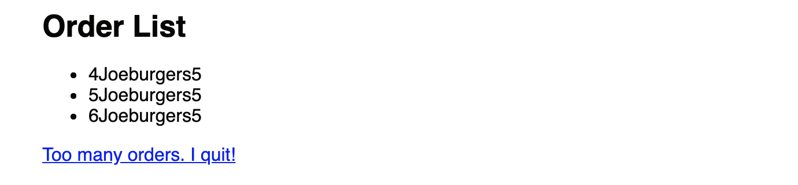

# React Conditionals

Now that we have a list correctly rendered, let's continue to work on features that depend on this list. In the ShakeShack app, if the number of orders becomes too high, as an employee, you're allowed to show some self-dignity and quit your job right on the spot! If the number of food orders exceeds 10, a link should show up at the bottom of the list which you can click on to "quit" your job!

The number of food orders is NOT the number of orders in the list. It's the total number of food orders. For example, if your fake list looks like this:

```json
[
    {
        id: 1,
        food: "burgers",
        numFood: 3
    },
    {
        id: 2,
        food: "fries",
        numFood: 4,
    },
    {
        id: 3
        food: "shakes",
        numFood: 5
    }
]
```

The quit link will show up because you have 12 pending food orders. There are 3 customer orders, but we have to make 3 burgers, 4 fries, and 5 shakes (12 food orders).

## Exercise: calculate total num of food orders

You can use the Javascript `forEach` function. It simply applies a function to every element in a list.
*Note:* `forEach` and `map` are very similar. The difference is that `map` is for replacing elements in a list while `forEach` simply executes a function. In this case, we are adding the number of food per order to a variable.

```javascript
let totalNumberOrders = 0;
orders.forEach(order => {
    totalNumberOrders = ...
});
```

## Conditionals with React

In React, you can decide to show a component / html element using conditionals. Here's how they usually work.

```javascript
let mysteryBlock = (<div></div>);               // An empty div block. Displays nothing.
if (showMysteryBlock) {                         // Variable `showMysteryBlock` is a boolean variable
    mysteryBlock = (<h1>Booga Booga!!!</h1>);   // Replace div block with actual content
}
```

This snippet is creating some variable `mysteryBlock`. If `showMysteryBlock` the boolean variable is true, set the MysteryBlock to something. If it is not true, `mysteryBlock` continues to be an empty `<div>` which is basically nothing. Later in your render function, you can inject the `mysteryBlock` like this:

```javascript
render() {
    <div>
        {mysteryBlock}
    </div>
}
```

## Exercise: Get the "Quit" link to show up ONLY if there are too many orders

1. Calculate the total food orders by iterating through the list.
2. Create a `Link` that may or may not show up depending on the total number of food orders. If this number is >= 10, show the Link. Otherwise, do not show the Link.

To create a React Link, use this:

```html
<Link to="/quit">Too many orders. I quit!</Link>
```

In order to create a `<Link/>`, you'll need to import it first at the top of the file.

```javascript
import { Link } from "react-router-dom";
```

We'll talk more about Links later, but make sure that a hyperlink shows up when there are >= 10 food orders, and nothing if there aren't that many food orders. When the `<Link>` correctly shows up, it should bring you to the starter "Quit" page.



**However, make sure that if the total number of orders is less than 10, this link should not show up!**

---

[Continue](./11_react_links.md)