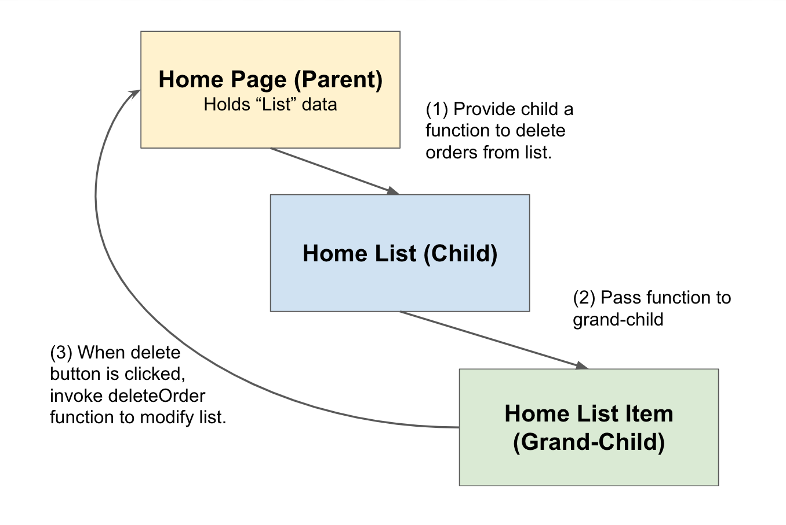
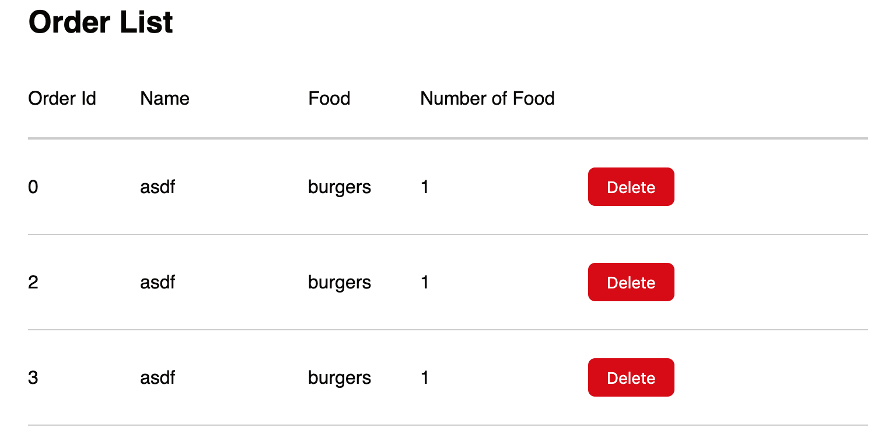

# Exercise: React Shakeshack Delete Function Parameter

By this step, you should be able to successfully add new orders to a list, and display the updated full list of orders. With every order in this list, there should be a "Delete" button which should remove the selected order from the list.

To fully implement the Delete Order feature, we'll have to do the following:

- Create the "Delete Order" button for every row in order list
- Hookup a `deleteOrderFromList` function to successfully delete order from the list
- Style Delete Order button

## Create a Delete Order button

For each row in our list, create a Delete Order button.

*Hint* This button should be part of your `HomeOrderListItem` Component.

## Create Function and Pass

When clicking on this button, it should invoke a `deleteOrderFromList` function. Remember, the original list data is in the `HomePage` component so this component also has the `deleteOrderFromList` function. This delete button in every list item needs to somehow call this `deleteOrderFromList` function when it is clicked. In order to do that, we're going to need to pass functions from parent to children. We'll have to pass the parameter function from `HomePage` to `HomeOrderList`, then from `HomeOrderList` to `HomeOrderListItem`.

*Note* This `deleteOrderFromList` function takes in an `orderId` as its parameter. You will need to invoke the parameter function with the `orderId` passed in. So the signature of the function looks like this:

```javascript
deleteOrderFromList = (orderId) => {
    // ... to be implemented
    // find order with the same `orderId` and delete it.
}
```



## Style

Give the delete button the following style:

- Button should have more width than height (you can use padding to keep text centered)
- no border, but border radius of 6px
- no outline
- red background color, but white text color (use variables from `_constants.sass`)
- font size is 14px
- *bonus:* when you hover over this button, the cursor should be the pointy finger and make the brightness of the button a little lighter (only on hover)

```sass
filter: brightness(1.1)
cursor: pointer
```



In the above example, I deleted the order with Id 1.

---

[Continue](./15_callbacks.md)