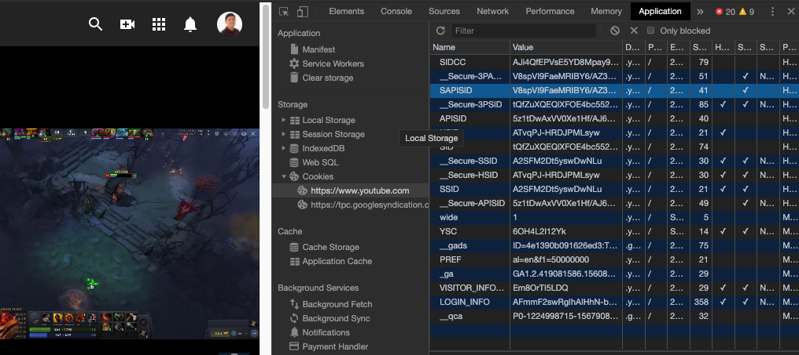

# Cookies & LocalStorage

If you've noticed, every time you load your home page, all your food items get lost and must be re-populated. In real life, this would be quite a problem for real users if their shopping carts or order items get accidentally lost from a page refresh.

One of the ways to get around this is to use something called **Cookies**! Cookies are just pieces of data that a browser stores on your computer. It's mostly used to track login information or websites you've recently interacted with. So for example, Cookies might be used to store your Facebook login information, so the next time you go to www.facebook.com, the login information is saved and you can skip the sign in process.

To learn more about Cookies, watch this youtube video: https://www.youtube.com/watch?v=rdVPflECed8.

To view your Cookie information, go to a website and open the Inspect tool.
Navigate to the Application tab and view the Cookies section in the sidebar.The example below is what it looks like for Chrome users. I can't tell you what all this information means, but notice how the information is associated with `www.youtube.com`. This is probably data that relates to my viewing habits so advertisements or Youtube can recommend content that's more catered to my preferences.



## LocalStorage

Today, we're going to learn about LocalStorage which is a HTML5 feature that surpasses Cookie functionality in several ways. LocalStorage is similar to Cookies, in which it saves user information for every website on your computer. But it's slightly better because it:

- Can store more information than a cookie
- Can more easily access saved data using key-value pairs

The weakness of using LocalStorage is because it is a more modern tools, some old browser versions may not support it.

## Using LocalStorage

To use localStorage, it's pretty simple. LocalStorage works very similar to Maps, Dictionaries or Javascript Objects, in which keys are mapped to values.

For example, I could store Aaron's user information with the following:

```javascript
window.localStorage.setItem("favorite_color", "red");
window.localStorage.setItem("favorite_food", "fried chicken");
```

The `setItem()` function takes in two parameters: a key and a value. So the mapping would look like this:

```
{
    "favorite_color" -> "red"
    "favorite_food" -> "fried chicken"
}
```

To retrieve data from localStorage, you would pass in the key to retrieve the value.

```javascript
window.localStorage.getItem("favorite_color");  // "red"
window.localStorage.getItem("favorite_food");   // "fried chicken"
```

And that's it! It's very simple. *NOTE* that this data is only available on a per-website basis. For instance, if this information is saved for `www.facebook.com`, this localStorage data is ONLY available when you're on `www.facebook.com`. In our case, the localStorage will be saving this data for the domain `http://localhost:8080`.

Finally, if we ever want to start over or clear information, use `window.localStorage.clear()` to erase all key-value mappings (only for the current website domain, so localStorage for other websites will not be affected).

To view a website's localStorage information, go to Inspect > Application > LocalStorage (very close to the Cookies section) in your browser.

---

[Continue](./16b_component_didmount.md)