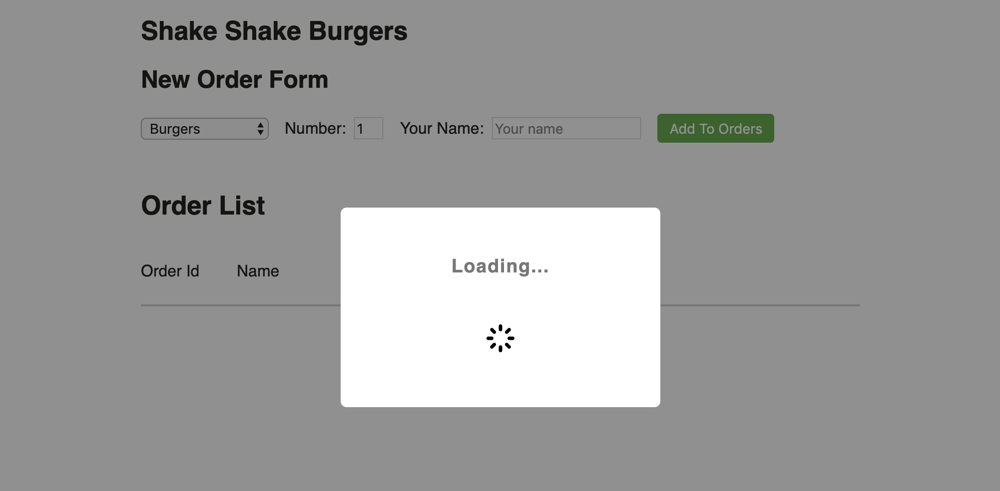
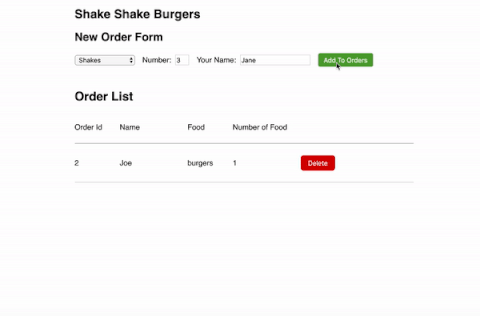

# The Loading Screen

Take a moment to review [Asynchronous Calls](./15a_asynchronous_calls.md) and [Callbacks](./15b_callbacks.md). They'll be very important here in this section.

## Setup the Loading Component

Inside the `components` folder, you should see another component called `LoadingPopup` defined in `loading.js`.

Your job is to...

1. Add `LoadingPopup` to the `HomePage` component.
2. Create a state variable in `HomePage` called `showLoading`. This variable is a boolean which will tell us to show the loading popup if true, or hide it if false.
3. Pass this `showLoading` variable as a parameter of `LoadingPopup`. Inside `LoadingPopup`, the `props.show` will dictate whether we show the popup or not.

So somewhere in this 3 step process, you should have this:

```javascript
<LoadingPopup show={this.state.showLoading}/>
```

*TIP* Underneath the hood, the show/hide functionality is actually done through CSS. Take a look at `loading.sass`, `#popup-loading` has default `display: none` which means it is hidden by default. If the className `show` is present, we override `#popup-loading` to have `display: block` instead. Take another look at `loading.js`. You should see that if the `props.show` variable is true, we add the className "show". Otherwise, it remains as empty and thus `display: none`.

At this point, you should be able to get the `LoadingPopup` to show when the state variable is initialized to true. If the state variable is initialized as false, you should not see the loader.



## Adding Animations

We're going to add an animation to the spinner in the loading popup! This can all be done by CSS.

In your `loading.sass`, add the following:

1. Define the animation called `spin`.

```css
@keyframes spin
    from
        transform: rotate(0deg)
    to
        transform: rotate(360deg)
```

2. Attach the animation properties to the img

```css
animation-name: spin
animation-duration: 2s
animation-direction: normal
animation-iteration-count: infinite
animation-timing-function: linear
```

## Loading on Add Order

Let's say whenever we add an order, the managing software takes a second or two to process the newly input data. The idea is once a user clicks on "Add Order", we show a "Loading..." message while the data is processing. When the data processing is finished, hide the loading message and let the user continue working with the application. In this section, we are going to fake a network API call and practice using Promises.

Let's introduce a new function `apiAddOrderToList(order)` that implements this whole loading flow as just described. This function will implement the loading flow and then call the original "add order" function.

Add this function to the `HomePage` component. This function has the following flow when it is called:

- Set `showLoading` to true. The Loading screen should appear. Make sure to use `this.setState` to change a state variable.
- In the success case, call the `addOrderToList(order)` function that you created earlier.
- In the fail case, alert the user that the function failed. Use `window.alert(...)`.
- In either case, set `showLoading` back to false so the Loading screen disappears.

```javascript
apiAddOrderToList = order => {
    // TODO: set showLoading to true

    API.addOrder() // Calls a fake network call that takes a few seconds
        .then(() => {
            // TODO: call `addOrderToList`
        })
        .catch(() => {
            // TODO: alert user of failure
        })
        .finally(() => {
            // TODO: set showLoading to false
        });
}
```

***HINT***
`API.addOrder()` is our "fake network call" that takes a few seconds to finish. It is a Promise object, so we'll have to use the `.then`, `.catch`, and `.finally` where we dictate what happens AFTER the network call is finished (success or failure result).

## Attach new function as addOrderCallback

Now that we've created a new function that correctly details the loading flow, we need to attach it to `HomeOrderForm`. In your call, the `HomeOrderForm`, you should have linked `addOrderCallback` to the older function `addOrderToList(...)`. Now, you'll have to link it to `apiAddOrderToList(...)` instead so it can use the loading functionality.

```javascript
<HomeOrderForm addOrderCallback={this.apiAddOrderToList} />
```

When all of these steps are completed, you should be able to click on "Add Order", and the loading popup should appear for about a second. It should then automatically disappear by itself. Great work!



## How does the loading screen delay for a second?

Take a look at `api.js`. Under the `addOrder` function, you can see the implementation. This function creates a new Promise object and uses this javascript function called `setTimeout`, which is used to invoke some function after a specified amount of time.

In this case, the specified time is dictated by the value `API_WAIT_TIME_MS`. Look at the top of the file and change the value to test if the loading process becomes slower or faster.

Also, play with `API_WORKS`. This value can help you test both the success case or the failure case of the addOrder Promise.

---

[Continue](./20_finish_line.md)